# Belajar Frontend Dengan Svelte

### Apa Itu Svelte ?

Svelte adalah **framework JavaScript** untuk membangun antarmuka pengguna (UI) — mirip seperti React atau Vue, tetapi dengan pendekatan yang berbeda.

Kalau React atau Vue menjalankan banyak logika di **browser** menggunakan Virtual DOM, Svelte justru melakukan sebagian besar pekerjaan di **compile time** (saat proses build). Jadi kode Svelte dikompilasi menjadi JavaScript murni yang sangat efisien, tanpa membawa runtime library besar.

### Kenapa Harus Belajar Svelte ?



### Lebih Mudah untuk Pemula

* Sintaksnya sederhana, mirip HTML + JavaScript biasa.
* Tidak perlu ribet dengan _setState_, _useEffect_, atau konsep yang rumit seperti di React.
* Belajar lebih cepat → cocok buat siswa/mahasiswa yang baru masuk dunia front-end.



### Performa Tinggi, Ringan

* Svelte compile-time framework, jadi kode dikompilasi jadi JavaScript murni yang super cepat.
* Bundle size kecil → aplikasi lebih ringan, cocok untuk web modern dan mobile.



### Produktivitas Tinggi

* Lebih sedikit kode, tapi hasil sama atau bahkan lebih bagus dibanding framework lain.
* File .svelte menyatukan HTML, CSS, dan JS → gampang dipahami.
* Lebih fokus ke fitur aplikasi, bukan konfigurasi.



### Dipakai Industri

* Banyak startup pakai Svelte karena lebih efisien dan gampang dikelola tim kecil.
* Ada framework besar berbasis Svelte, yaitu SvelteKit, untuk membangun web apps lengkap (mirip Next.js di React).



### Tren yang Berkembang

* Komunitas Svelte makin besar, banyak perusahaan melirik karena lebih hemat resource.
* Belajar Svelte sekarang = punya keunggulan dibanding orang lain yang hanya tahu React/Vue.



### Apa Saja yang Dipelajari ?

Kursus akan dilaksanakan dalam 4 minggu, dengan 2 kali pertemuan setiap minggu nya. Teman-teman diharapkan membawa Laptop sendiri dalam proses pembelajaran.



### Minggu Pertama

Teman-teman akan memahami & familiar dengan Svelte

1. Dasar svelte
2. Dasar website
3. syntax
4. etc.



### Minggu Kedua

Teman-teman dapat membuat sebuah ui dengan dinamis

1. ui dinamis dengan kondisional dan looping
2. form
3. binding
4. etc.



### Minggu Ketiga

Teman-teman dapat memahami _store_ dan _external fetching data_

1. store
2. fetching data
3. Mini Project
4. etc.



### Minggu Keempat

Teman-teman dapat memahami transisi, _routing,_ dan membuat aplikasi final

1. Deploy ke Netlify / Vercel
2. etc.



### Biaya Belajar

```mermaid fullWidth="true"
flowchart TD
    A[💰 Bayar Biaya Awal] --> B[📚 Ikut 3 Pertemuan Percobaan]
    B --> C{Lanjut Kursus?}
    C -->|Ya| D[💳 Bayar Penuh Sisa Biaya]
    C -->|Tidak| E[🚪 Berhenti Tanpa Bayar Lagi]
```

### Form Pendaftaran

Masih proses update, mohon ditunggu Teman-teman
